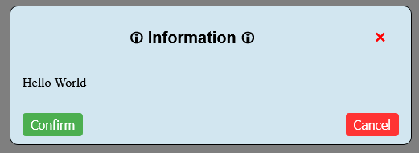
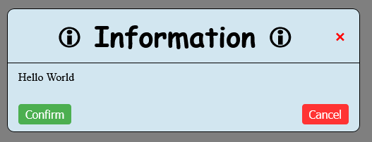
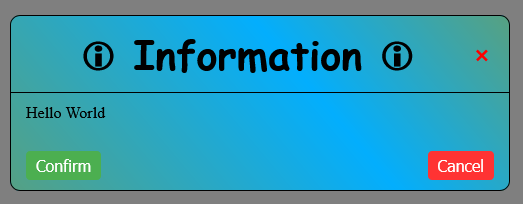

# MessageboxLib

With this library you can easily use messageboxes in your project.

### Why would you use it?
If you want a simple messagebox on your website to ask for confirmation or just display some information to the user this simple sounding task can be quite annoying.  
You could use a whole framework like react for this simple task but this is really overkill if it is a small application.  

You have three options now:  
__First option:__ Using the default html dialog with `alert("Hello World")` for example. But this is ugly as hell and does not look quite professional.  
__Second option:__ Code your own custom css messagebox. Nothing wrong with that   

Or the in my opinion __best option__: Using this lightweight library to get easy access to good looking messageboxes.  
And if you don't like the default design, you can change almost every aspect of the messagebox. Like the colors, font, size, spacing, and so on.  
And you are not limited to display the user static text, you can use your own html, css and Javascript in the messagebox.

### What are the advantages using this library?

First of all, it is super easy to include this into your project. All you have to do is add the following line to the head part of your html file:  
```
<script src="https://cdn.jsdelivr.net/gh/Tobias-Auer/messageBoxLib/messageBoxes.js" defer></script>
```
Additionaly, it is really lightweight. All necessary files are in total under 25 KB, which is not much at all.

So if you want to have a fast, good looking, strongly customizable options to use messageboxes in your project give it a try. :)

Now, you have free access to use all functions the library provides.

As mentioned above, you are able to use your own html, css and Javascript in the messagebox. As a default this option is disabled for security reasons but by adding one parameter to the call function it will be enabled and then there are almost no limits what you can do with that.  

## How to use the library?

After you loaded the script and css file you can immediatley call a messagebox with the folling command:
`messagebox_info()` or use `messagebox_warning()` or `messagebox_error()` instead.

They are really similar to each other, only the default css settings are different here.

If you call a messagebox you need add 3 to 5 arguments.

The first on is the `header=` and is the text (or html if you want to) which is displayed in the title of the messagebox in the middle of the corresponding icons. How to change or even remove them I'll explain later.
The second parameter is the `detail=` parameter. With that you can decide what is displayed in the body of the messagebox. You can use html, css and js here too.

The third required parameter, is the `buttons=` parameter. With that you can decide how many buttons you want to have and what they are labeled.

You can start by adding:  
`buttons={confirmationButton: 'Confirm',  cancelButton:'Cancel'}`
That will create two buttons, one is labeld "Confirm" and the other "Cancel". The first one is bound to the confirm event and the other to the cancel event. More on that later.

In summary you code should look like this now:
```
messagebox_info(
    header='Information', 
    detail='Hello World', 
    buttons={
      confirmationButton: 'Confirm', 
      cancelButton:'Cancel'}
    )
```

If you call this code now within your javascript or maybe a onclick function from a button you will get the following result:



But you will quickly notice that nothing happens if you click at any of these buttons. We will change that now.

First, we add two small functions to simulate some actions we are defining two small functions:
 ```
function confirmEvent() {
    console.log("You triggered the confirm event!")
}

function cancelEvent() {
    console.log("You triggered the cancel event!")
}
```

To call these functions from the messagebox we have to add a new parameter called `options=`.  
Here we are defining what should happen if you click the confirm button or the cancelbutton or close the window in any other way.

The syntax for that is the following: 
```
options= {
    confirmationCallback: confirmEvent, 
    confirmationParams: [], 
    cancelCallback: cancelEvent, 
    cancelParams: []
}
```

With `confirmationCallback` and `cancelCallback` you can choose what should happen if the confirmation or cancel event is triggered. With the corresponding `Params` argument you can add arguments which should be passed through.

Lets implement these changes and see how it looks now.
The code should look like this now
```
messagebox_info(
    header='Information', 
    detail='Hello World', 
    buttons={
      confirmationButton: 'Confirm', 
      cancelButton:'Cancel'
    },
    options= {
      confirmationCallback: confirmEvent, 
      confirmationParams: [], 
      cancelCallback: cancelEvent, 
      cancelParams: []
    }
)
```

Now call this function again and see in the browser terminal what happens if you click the buttons or close the messagebox by clicking the X for example.


If you click the confirm button, no matter what the text of this button is, the `confirmEvent` function is called. If you close the window with any other method, like the cancel button, the X or clicking outside the box, the cancel event is called.

Do you need all that?  

No, of course not!
If you want to only have a confirm button or just a cancel button for what ever reason or no button at all, just leave the parts you dont want out. For example, only a confirmation button:
```
buttons={
    confirmationButton: 'Ok', 
},
options={
    confirmationCallback: confirmEvent, 
    confirmationParams: [], 
}
```

or no button at all:
```
buttons={},
options={}
```
or two buttons, but nothing set for the cancel event:
```
buttons={
    confirmationButton: 'Confirm', 
    cancelButton:'Cancel'
},
options= {
    confirmationCallback: confirmEvent, 
    confirmationParams: []
}
```

You can do it however you want. :)


### Enabling HTML

Maybe you have already tried to use html in your messagebox but it didn't showed up correctly. 

This isn't a bug, this is for security reasons to prevent [ XSS (Cross-Site Scripting)](https://en.wikipedia.org/wiki/Cross-site_scripting) from your page. If you really know what you do and trust everything displayed in the messagebox because the user cannot modify it or it is properly escaped by the backend, you can use the `allowHTML=true` paramater to allow HTML in the header and body of the corresponding messagebox. 

This can be everything from a simply `<strong></strong>` tag to make something bold, but also can be used for a lot of fancy stuff like iframes, submission forms, etc.   

<br>

## How to make changes to the default style of the messagebox?

The provided default format is nice but what if you want more but don't want to put the effort to make your own html with css just for changing the font or background or what so ever?

If that`s the case, I'm glad to tell you that there is a simple solution. :)

Just use the built-in config function to change the design from the messageboxes.

The built-in function is called `editModal()` and takes one argument in form of an array.

First create an array called `modalConfig` for example. You can do that by adding this line:   
`const modalConfig = {}`   

Now insert everything you want to change into that array and pass it to the function `editModal(modalConfig);`

Now you may be asking, what can I change at all? The answer: A lot!

We can start simple and change the font-size and font-family from the info messagebox.
We can do that by adding these two options into the array. It will look like that:
```
const modalConfig = {
    infoTitleFont: "cursive",
    infoFontSize: "30pt",
};
editModal(modalConfig);
```
<strong>Note:</strong> You can call this whenever you want. You could make a whole menu for that and then appling all that style changes. You also could modify them at the very beginning of you HTML file so that they are like that from the beginning on. But if you do that you must add a load condition to it because it will be executed as soon as it reaches the statement but then the scriptfile won't be loaded yet due to the necessary defer tag.  
That's why if you want to modify the values from the beginning on, add this to the \<head> tag:
```
<script>
    document.addEventListener("DOMContentLoaded", function () { // really important!
      const modalConfig = {
        infoTitleFont: "cursive",
        infoFontSize: "30pt",
      };
      editModal(modalConfig);
    });
</script>
```

Now start the html file again which could look like this by now:
```
<!DOCTYPE html>
<html lang="en">
  <head>
    <meta charset="UTF-8" />
    <meta name="viewport" content="width=device-width, initial-scale=1.0" />
    <title>documentation</title>
    <link rel="stylesheet" href="style.css" />
    <script src="messageBoxes.js" defer></script>
    <script>
      document.addEventListener("DOMContentLoaded", function () {
        const modalConfig = {
          infoTitleFont: "cursive",
          infoFontSize: "30pt",
        };
        editModal(modalConfig);
      });
    </script>
  </head>

  <body>
    <button
      onclick=" messagebox_info(
            header='Information', 
            detail='Hello World', 
            buttons={
                confirmationButton: 'Confirm', 
                cancelButton:'Cancel'
            },
            options= {
                confirmationCallback: confirmEvent, 
                confirmationParams: [], 
                cancelCallback: cancelEvent, 
                cancelParams: []
            }
        )"
    >
      Button 1
    </button>

    <script>
      function confirmEvent() {
        console.log("You triggered the confirm event!");
      }

      function cancelEvent() {
        console.log("You triggered the cancel event!");
      }
    </script>
  </body>
</html>
```

and gives following output:


As you can see the title is now bigger and in the 'cursive' font. If you now change `messagebox_info` to `messagebox_warning` or `messagebox_error` you will see that this design rules do not apply for them too.

That's because we explicitly set it for the info messagebox by typing `infoTitleFont` and `infoFontSize`. If you want that design change for the other two you just have to replace 'info' with 'warning' or 'error'.

All options to modify the title bar:

- <strong>infoPrefix</strong>
- <strong>infoSuffix</strong>
- <strong>warningPrefix</strong>
- <strong>warningSuffix</strong>
- <strong>errorPrefix</strong>
- <strong>errorSuffix</strong>  
<br>

- <strong>infoTitleColor</strong>
- <strong>infoTitleFont</strong>
- <strong>infoTitleFontWeight</strong>
- <strong>infoBackgroundColor</strong>
- <strong>infoFontSize</strong>  
<br>

- <strong>warningTitleColor</strong>
- <strong>warningTitleFont</strong>
- <strong>warningTitleFontWeight</strong>
- <strong>warningBackgroundColor</strong>
- <strong>warningFontSize</strong>  
<br>

- <strong>errorTitleColor</strong>
- <strong>errorTitleFont</strong>
- <strong>errorTitleFontWeight</strong>
- <strong>errorBackgroundColor</strong>
- <strong>errorFontSize</strong>  
<br>

- closeButtonBackgroundColor
- closeButtonColor
- closeButtonText
- titleMargin


The last four options aren't so important but if you want to change them feel free to go ahead. 

If there is 'info', 'warning' or 'error' in the name this means it only changes the design for that type of messagebox. If not, that design applies for all messageboxes.

With the 'prefix' and 'suffix' options you can replace the symbols in front and after the title. You can replace them with an empty string, your own unicode symbol or basic text if you want to.

But thats not all there are also some options to modify the body of the messageboxes:
- <strong>bodyFont</strong>  
- <strong>bodyFontSize</strong>  
- <strong>bodyFontWeight</strong>  
- <strong>bodyColor</strong>  
- <strong>bodyBackgroundColor</strong>

And one option to configure the background for the whole messagebox:  
- <strong>backgroundColor</strong>  

To be honest, these options aren't that much, but it should be enough for the most projects and don't forget that you can use your own css if you really want to.

For example you could add  
`backgroundColor: "linear-gradient(50deg,rgb(85, 161, 132) 0%,rgb(3, 174, 253) 60%,rgb(85, 161, 132) 99%)"`  
to have a cool gradient as a background.  

  

Isn't that cool?

Last but not least, there are plenty of options for the buttons:
- <strong>confirmationButtonBackgroundColor</strong>  
- <strong>confirmationButtonBorder</strong>  
- <strong>confirmationButtonColor</strong>  
- <strong>confirmationButtonPadding</strong>  
- <strong>confirmationButtonTextAlign</strong>  
- <strong>confirmationButtonTextDecoration</strong>  
- <strong>confirmationButtonDisplay</strong>  
- <strong>confirmationButtonFontSize</strong>  
- <strong>confirmationButtonMargin</strong>  
- <strong>confirmationButtonCursor</strong>  
- <strong>confirmationButtonBorderRadius  </strong>  
<br>  

- <strong>cancelButtonBackgroundColor</strong>  
- <strong>cancelButtonBorder</strong>  
- <strong>cancelButtonColor</strong>  
- <strong>cancelButtonPadding</strong>  
- <strong>cancelButtonTextAlign</strong>  
- <strong>cancelButtonTextDecoration</strong>  
- <strong>cancelButtonDisplay</strong>  
- <strong>cancelButtonFontSize</strong>  
- <strong>cancelButtonMargin</strong>  
- <strong>cancelButtonCursor</strong>  
- <strong>cancelButtonBorderRadius </strong>  
<br>  

- <strong>spaceButtons</strong>  

Most of them should be self explaining or just try them out if you are curious what they do exactly.

I hope you like this small project and it helps you in your project :)


Btw, quick side note, this documentation is not generated by AI and took way too long to create. Thanks for reading to the end :)
